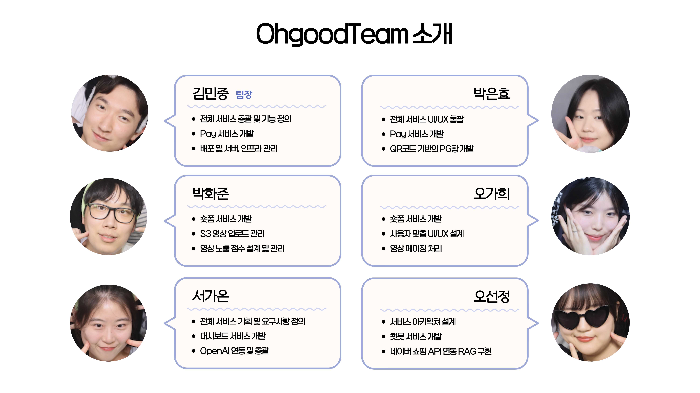
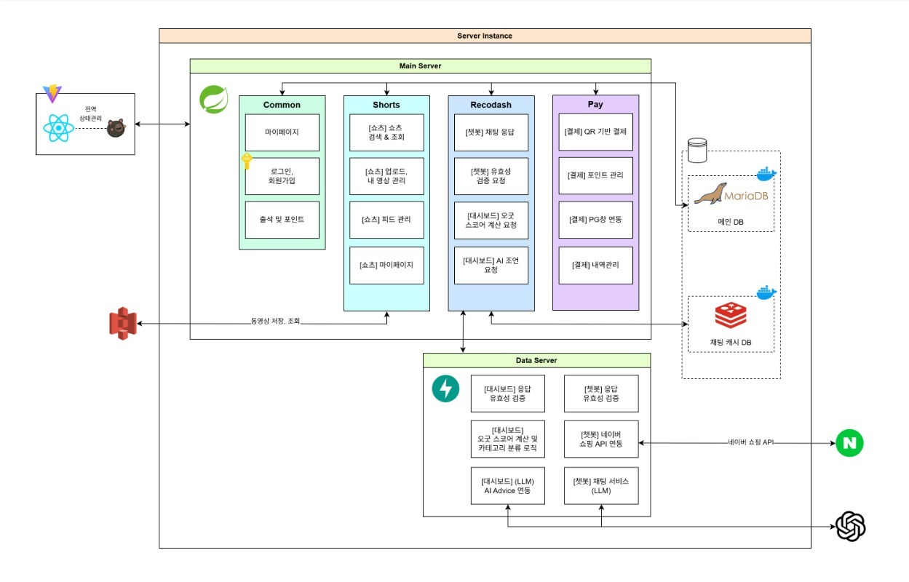
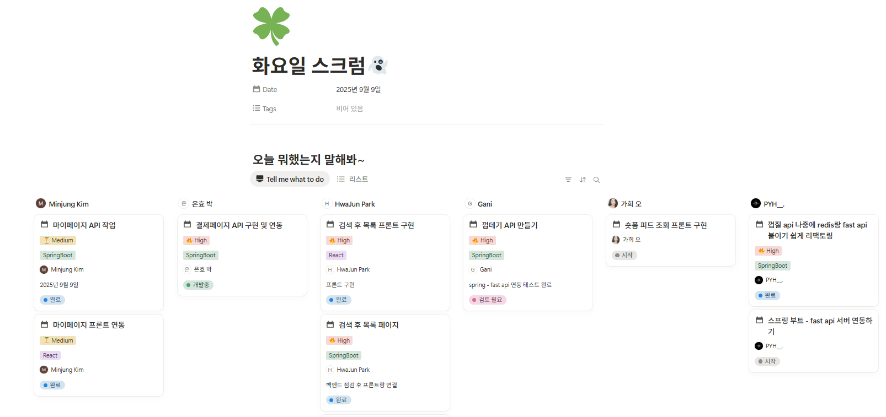

<h1>
  OhgoodPay<br>
 <h2>페이와 숏폼이 붙었다 쓰는 순간 즐거워지는 오굿페이</h2>
</h1>

<br>
<a href="https://ohgoodteam.shinhanacademy.co.kr/">
    
</a>

<p style="text-align: center;">이미지를 클릭하면 ohgoodpay로 이동합니다.</p>

## 🔗 목차

1. [프로젝트 소개](#프로젝트-소개)
2. [주요 기능](#주요-기능)
3. [팀 소개](#팀-소개)
4. [기술 스택](#기술-스택)
5. [파일 구조](#파일-구조)
6. [시스템 구조](#시스템-구조)
7. [보안](#보안)
8. [빌드 방법](#빌드-방법)
9. [협업 규칙](#협업-규칙)

----------------------------

<h2 id="프로젝트-소개">🖐🏻 프로젝트 소개</h2>
### OhgoodPay는 BNPL을 지원하는 페이 서비스 입니다.   
<br>

<br>  

### BNPL이란?  
**Buy Now, Pay Later**의 약자로 상품을 구매한 뒤, 일정 기간 후에 결제 대금을 지불하는 후불결제  
  
오굿페이의 BNPL 서비스는 카드 없이도 간편하게 사용할 수 있는 후불결제 솔루션입니다.  
신용카드 발급이 어려운 사용자, 당장 현금이 부족한 사용자도 **합리적인 소비**를 할 수 있도록 지원합니다.  
안전하고, **이자 없는** 단기간 후불 결제를 원하는 **누구나 사용 가능**합니다.  

 **“지금 사고, 나중에 갚는”** BNPL 서비스를 오굿페이에서 만나보세요.   

----------------------------

<h2 id="주요-기능">🎯 주요 기능</h2>

### 👤 사용자
- 카드 없이 간편하게 "지금 구매, 나중에 납부" 가능  
- 연체 없이 납부 및 결제, 숏폼 등을 통한 포인트 리워드 제공  
- 사용자 맞춤형 소비 리포트 제공으로 소비 습관 확인 가능  
- AI를 활용한 챗봇 서비스로 개인화된 상품 추천 가능  
- OhgoodScore를 통한 신용도 확인 가능  
- 한도 선정 이유 공개 및 등급 제도 확인 가능  

### 🧑‍🍳 가맹점  
- 오굿페이 BNPL 위젯 제공  
- API 연동으로 자체 서비스에 연동 가능  

### 👀 운영자  
- 사용자의 연체율, 이용 패턴 등을 분석해 OhgoodScore 산정  
- 결제 흐름, 연체 현황, API 호출 이력 등 모니터링 가능  
- 추천 시스템 및 PG창 연동으로 광고 효과 및 가맹점 관리 가능  

----------------------------

<h2 id="팀-소개">👥 팀 소개</h2>



----------------------------

<h2 id="기술-스택">🔧 기술 스택</h2>

| 구분             | 기술 스택                                                                                                                                                                                                                                                                                                                                              |
| ---------------- | ----------------------------------------------------------------------------------------------------------------------------------------------------------------------------------------------------------------------------------------------------------------------------------------------------------------------------------------------------- |
| Frontend         |    |
| Backend          |      
| Database         |                                                                                                                                                   |
| Infra & Cloud    |                               |
| 외부 API         |                                                                                                                                    |


----------------------------

<h2 id="파일-구조">📂 파일 구조</h2>  

### BE - Spring Boot
[Spring Boot Repo 바로가기](https://github.com/OhGoodTeam/OhgoodpayBE.git)  

```markdown
ohgoodpay/
├── OhgoodpayApplication.java        // Spring Boot 메인 실행 파일
├── common/                          // 공통 도메인(회원가입, 마이페이지 등) 서비스
├── pay/                             // 결제 및 포인트(BNPL 핵심) 서비스
├── recommend/                       // 대시보드 및 AI 추천 서비스
├── shorts/                          // 숏폼 커뮤니티(구독/댓글 등) 서비스
├── security/                        // JWT 및 사용자 인증 보안
│   ├── config/                      // Spring Security 설정
│   ├── filter/                      // 로그인/토큰 필터
│   ├── service/, util/              // 인증 서비스, JWT 유틸
│
├── config/                          // 글로벌 설정 파일들, CORS, Redis 등
├── scheduled/                       // 정기 작업 (스케줄링 서비스)
├── exception/                       // 커스텀 예외 및 전역 에러 핸들링
└── resources/                       // 공통 환경 설정 및 Redis, FastAPI 등 설정 파일

```  

### BE - FastAPI  
[FastAPI Repo 바로가기](https://github.com/OhGoodTeam/OhgoodpayML.git)  
```markdown  
OhGoodPayML/ 
├── main.py                          # FastAPI 진입점 (서버 실행 파일)
├── config/                          # OpenAI, Naver API 키 등 환경 설정
│   └── openai_config.py, naver_config.py
│
├── domain/                          # 챗봇 흐름 처리, Ohgood Score 계산 로직, 카테고리 분류  
├── routers/                         # FastAPI 라우터 (엔드포인트 정의)
├── schemas/                         # Pydantic 기반 요청/응답 DTO
├── services/                        # 서비스 계층 (FastAPI 내부 로직)
│   ├── spring_client.py             # Spring ↔ FastAPI 간 연동용 클라이언트
│   └── narratives/                  # Dash용 AI 응답 흐름 처리 (prompt)
|
├── requirements.txt                 # Python 패키지 목록
├── .venv/                           # 가상환경 디렉터리 (로컬용)

```

### FE - React
[React Repo 바로가기](https://github.com/OhGoodTeam/OhgoodpayFE.git)    
```markdown
src/
├── App.jsx, App.css, index.jsx, index.css   # 앱 진입점 및 글로벌 스타일
│
├── features/                                # 도메인별 기능 모듈화
│   ├── auth/                                # 로그인/회원가입 관련
│   ├── common/                              # 마이페이지, 회원정보 관리
│   ├── home/                                # 홈 화면 (BNPL, 체크인, 퀵액세스 등)
│   ├── pay/                                 # 결제 위젯, 포인트, 납부 내역
│   ├── planet/                              # 확장 예정 기능
│   ├── qrpin/                               # QR/핀 기반 결제
│   ├── recommend/                           # 대시보드 + AI 추천
│   └── shorts/                              # 숏폼(피드, 프로필, 검색, 업로드)
│
├── pages/                                   # 페이지 단위 컴포넌트 (라우팅 대상)
│   ├── auth/                                # 로그인, 회원가입
│   ├── common/                              # 마이페이지 화면
│   ├── home/                                # 홈 화면
│   ├── pay/                                 # 결제/포인트 조회 페이지
│   ├── planet/                              # (추가 예정)
│   ├── qrpin/                               # QR/핀 결제 페이지
│   ├── recommend/                           # 대시보드 & 챗봇 페이지
│   └── shorts/                              # 숏폼 관련 (피드, 프로필, 업로드 등)
│
└── shared/                                  # 공용 리소스 & 유틸
    ├── api/                                 # Axios 클라이언트 & API 모듈
    ├── assets/                              # 공용 CSS, 폰트, 이미지
    ├── components/                          # 공용 UI 컴포넌트 (버튼, 모달 등)
    ├── hook/                                # 커스텀 훅
    ├── layout/                              # 화면 레이아웃 (Main, Chat, Dash 등)
    ├── router/                              # React Router 설정
    ├── store/

```

----------------------------

<h2 id="시스템-구조">🧱 서비스 구조</h2>

  

1. 프론트엔드 (React + Vite)
- 사용자(웹/모바일)가 보는 화면.  
- 로그인/회원가입, 결제 위젯, 마이페이지, 숏폼(Shorts), 대시보드, AI 추천 등을 제공.
- Zustand를 이용한 상태관리, 백엔드 서버와 API 통신.

2. 메인 서버 (Spring Boot 기반)
- 서비스의 핵심 비즈니스 로직 담당.  
- 주요 도메인 모듈:Common, Shorts, Recodash, Pay  
- DB와 연결되어 트랜잭션 관리 + Redis 캐시 활용.  

3. 데이터 서버 (FastAPI + LLM 연동)  
- AI/추천/분석 기능을 맡는 서브 서버.  
- 주요 역할: 챗봇 응답 (LLM), 대시보드 오굿스코어 계산, 소비 카테고리 분류 및 분석
- OpenAI를 통한 AI 조언 생성, 네이버 쇼핑 API를 이용한 RAG 구현  

4. 스토리지 & 외부 연동
- MariaDB: 메인 데이터 저장 (사용자, 결제, 숏폼, 포인트 등)  
- Redis: 챗봇 캐시 DB (빠른 대화 응답 처리)  
- AWS S3: 숏폼 영상 저장소 (업로드/조회)  
- 네이버 쇼핑 API: 외부 쇼핑 데이터 연동  
- OpenAI API: AI 챗봇, 추천, 조언 생성에 활용  

----------------------------

<h2 id="빌드-방법">🚀 빌드 방법</h2>

### OhgoodpayBE

### 1) Java 버전 확인
```bash
java --version
# JDK 17 필요
```

### 2) FFmpeg 설치
```bash
# Windows
# https://www.ffmpeg.org/download.html 에서 다운로드 후 PATH 등록

# macOS
brew install ffmpeg

# Linux / EC2
sudo yum install -y ffmpeg

# 설치 확인
ffmpeg -version
```

### 3) 프로젝트 빌드
```bash
# Windows
./gradlew.bat clean build

# macOS / Linux
./gradlew clean build
```

### 4) 서버 실행
```bash
# Gradle로 실행
./gradlew bootRun

# 또는 JAR 직접 실행
java -jar build/libs/*.jar
```

**접속 URL**
- Swagger: http://localhost:8080/swagger-ui/index.html
- API Base: http://localhost:8080

### 5) 의존성 관리
의존성 추가/변경 시 build.gradle 수정 후 동기화
```bash
./gradlew clean build    # 의존성 업데이트
./gradlew dependencies   # 의존성 확인
```
### 기술 스택
- **JDK**: 17
- **Framework**: Spring Boot 3.5.5
- **Database**: MariaDB
- **Build**: Gradle (Groovy)

### 주요 의존성
- Spring Boot DevTools
- Spring Data JPA
- Spring Security
- MariaDB Driver
- Lombok
- JWT (jsonwebtoken 0.12.6)
- QueryDSL 5.0.0
- Swagger 2.6.0
- FFmpeg 8.0
- ZXing (QR/바코드)
  - com.google.zxing:core:3.5.2
  - com.google.zxing:javase:3.5.2

### 데이터베이스 설정
```properties
# application.properties
spring.datasource.url=jdbc:mariadb://localhost:3306/your_database
spring.datasource.username=your_username
spring.datasource.password=your_password
spring.datasource.driver-class-name=org.mariadb.jdbc.Driver
```

### Docker 배포
```bash
# 이미지 빌드
docker build -t app-backend .

# 컨테이너 실행
docker run -p 8080:8080 app-backend
```

### Podman 배포
- 애플리케이션 이미지에 FFmpeg 포함 필수
- `/tmp` 폴더 권한 확인 필요

---  

### OhgoodpayML
Ohgoodpay Reco&amp;Analytics

### 가상 환경(venv) 빠른 시작

### 1) Python 버전 확인
```bash
python --version
```  
  
### 2) 가상환경 설정  
- 가상환경 이름은 꼭 .venv가 아니어도 됨   

```
python -m venv venv 
.\venv\Scripts\Activate

python -m venv venv # windows / git bash
source venv/Scripts/activate

python -m venv venv # macOS / Linux / WSL
source venv/bin/activate
```    

### 3) 패키지 설치  
```
python -m pip install --upgrade pip
pip install -r requirements.txt
```

### 4) 서버 실행  
```
uvicorn app.main:app --reload --port 8000
deactivate   ## 비활성화  

```  
- Swagger: http://localhost:8000/docs

---  
### OhgoodpayFE  
Ohgoodpay Frontend (React + Vite)  

### 1) Node.js 버전 확인
```bash
node --version
npm --version
```  
### 2) 프로젝트 초기 설정
```bash
npm install
```
package.json 기준으로 필요한 의존성 자동 설치

### 3) 개발 서버 실행
``` bash  
npm run dev
```    
기본 접속 주소: http://localhost:5173

### 4) 빌드
```bash  
npm run build
```
----------------------------

<h2 id="협업-규칙">🤝 협업 규칙</h2>

### 🎈 Branch 규칙
- 메인 브랜치와 개인 이름별 브랜치를 구분하여 사용한다.
  - main : 배포 가능한 상태의 코드만을 관리하는 브랜치
  - dev  : main 배포 전 전체 기능 통합 test 브랜치

### 🎈 Commit 규칙
- 커밋 메세지는 다음과 같은 형식으로 작성한다.

```java
[이름] 명령:구현설명 ex) [gildong] feat:로그인서비스구현
```

- **깃 컨벤션**
    - feat : 로직 구현
    - docs : 정적 파일 추가
    - fix : 버그 수정

### 🎈 PR 규칙
- 공용 템플릿을 사용하여 PR을 작성 : [PR 템플릿 바로가기](https://github.com/OhGoodTeam/OhgoodpayML/blob/main/.github/PULL_REQUEST_TEMPLATE.md)

### 🎈 Issue 규칙
- 공용 템플릿을 사용하여 issue 작성 : [issue 템플릿 바로가기](https://github.com/OhGoodTeam/OhgoodpayML/tree/main/.github/ISSUE_TEMPLATE)

### 🎈 데일리 스크럼 
- 공용 템플릿을 사용하여 데일리 스크럼 작성   


